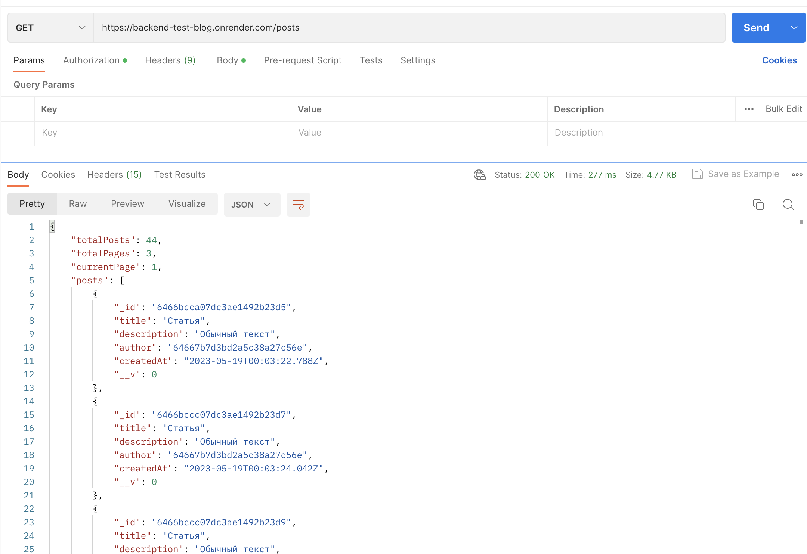

# Бэкенд блога для Тестового Задания

**Функционал:**

- Регистрация / Аутентификация
- Создавать, редактировать и удалять статьи

**Какие технологии используются:**

- Node JS
- MongoDB
- JWT
- Routes

---

**Инструкция**

# Регистрация нового пользователя

Эндпоинт: Method: POST https://backend-test-blog.onrender.com/signup
Обязательные поля для заполнения: name, email, password.

- name: должен быть строкой, минимальная длинна 2 символа, максимальная 30.
- email: должен быть строкой, на сервере валидируется на наличие спец.символов, должен быть уникальным.
- password: должен быть строкой, никак не валидируется и не имеет ограничений по длине, хэшируется с помощью технологии bcrypt, не хранится в открытом виде.

В ответ приходят данные зарегестрированного пользователя.

Пример:

Возможные ошибки:
400 - Переданы некорректные данные
409 - Пользователь с таким Email уже есть
500 - Ошибка сервера

---

# Авторизация

Эндпоинт: Method: POST https://backend-test-blog.onrender.com/signin
Обязательные поля для заполнения: email, password.

В ответ приходят данные авторизованного пользователя и token (jwt token), который в последствии нужно вшить в шапку запроса. Authorization и передавать с каждым запросом на сервер для индетификации юзера.
token хранит только id юзера.

Пример:

Возможные ошибки:
400 - Переданы некорректные данные
403 - Пароль или почта введены неправильно
404 - Пользователь не найден
500 - Ошибка сервера

---

# Создание нового поста

Эндпоинт: Method: POST https://backend-test-blog.onrender.com/posts
Обязательные поля для заполнения: title, author.

- title: должен быть строкой, минимальная длинна 2 символа, максимальная не ограничена.
- author: на сервер обязательно должен передаваться вместе с запросом токен юзера который создает пост.
- description: не является обязательным, может принимать как текст так и разные медиа файлы.

В ответ приходит новый пост в виде JSON, который содержит: title, description, author, createAt

Пример:

Возможные ошибки:
400 - Переданы некорректные данные
401 - Нет доступа
500 - Ошибка сервера

---

# Редактирование поста

Эндпоинт: Method: PATCH https://backend-test-blog.onrender.com/posts/:id
Обязательные поля для заполнения: author.
Обязательное условие! ID юзера который подает запрос должен совпадать с ID владельца поста, иначе придет ошибка 401
Можно внести изменения в title и description

В ответ приходит обновленный пост

Пример:

Возможные ошибки:
401 - Нет доступа
404 - Пост с таким ID не найден
500 - Ошибка сервера

---

# Удаление поста

Эндпоинт: Method: DELETE https://backend-test-blog.onrender.com/posts/:id
Обязательные поля для заполнения: author.
Обязательное условие! ID юзера который подает запрос должен совпадать с ID владельца поста, иначе придет ошибка 401

В ответ приходит обновленный пост

Пример:

Возможные ошибки:
401 - Нет доступа
404 - Пост с таким ID не найден
500 - Ошибка сервера

---

# Получение статей

Эндпоинт: Method: GET https://backend-test-blog.onrender.com/posts

В ответе сервер присылает общее количество статей, общее количество страниц, номер текущей страницы и массив статей (posts).
Для того, что бы получить другую страницу, в теле запроса необходимо указать номер страницы.

Пример:

Возможные ошибки:
500 - Ошибка сервера

---

# Технические эндпоинты

Эндпоинт: Method: GET https://backend-test-blog.onrender.com/users
В ответе приходит информация о всех пользователях на сервере

---

Эндпоинт: Method: GET https://backend-test-blog.onrender.com/user/:id
В ответе приходит информация о конкретном пользователе чей ID передан в параметрах запроса

---

Эндпоинт: Method: GET https://backend-test-blog.onrender.com/user/me
В ответе приходит информация о конкретном пользователе чей ID содержится в токене
